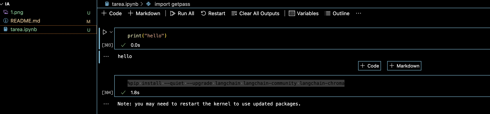
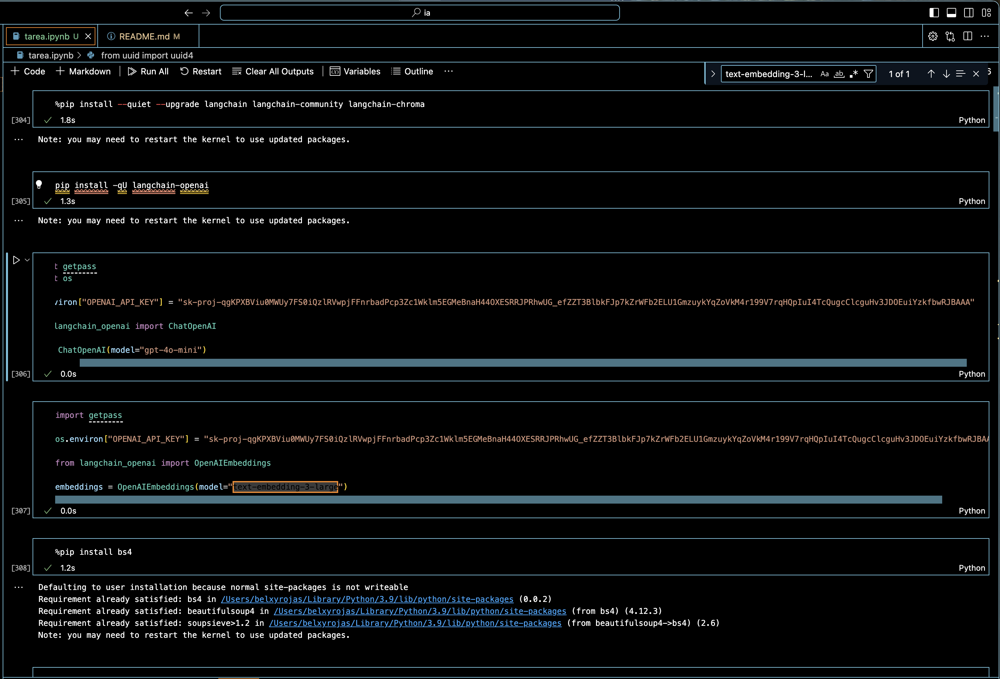
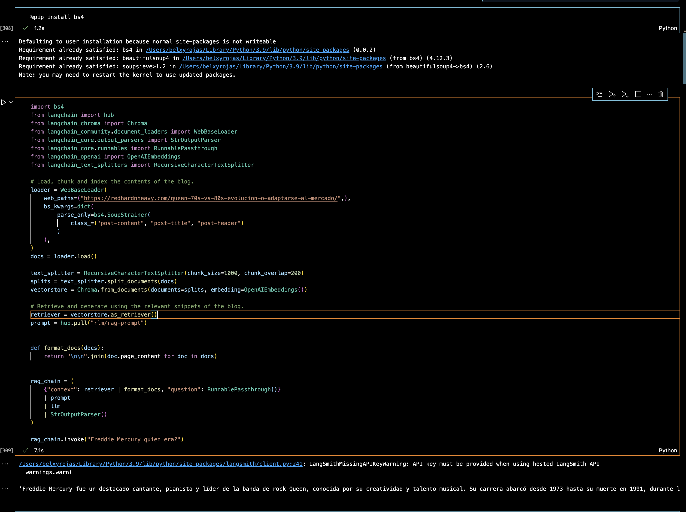
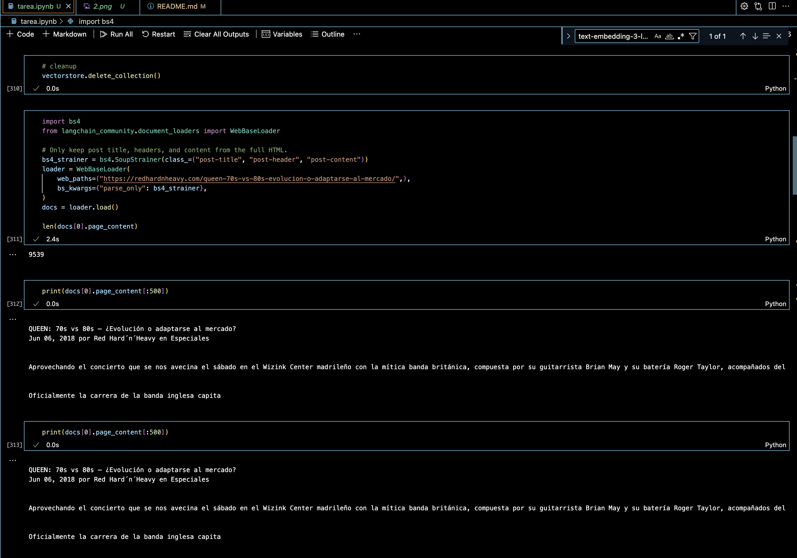
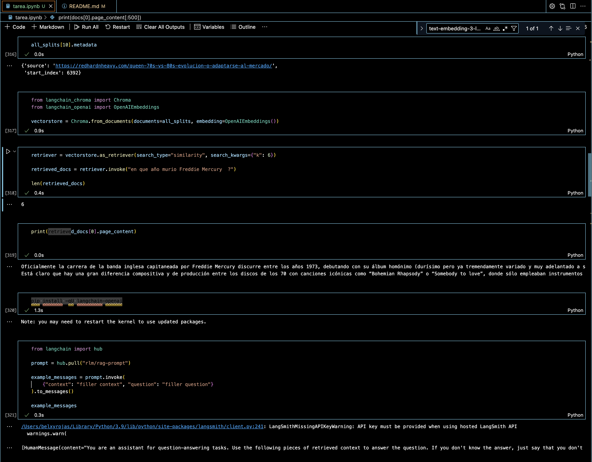
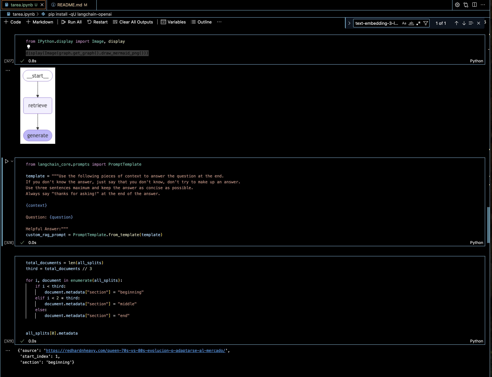
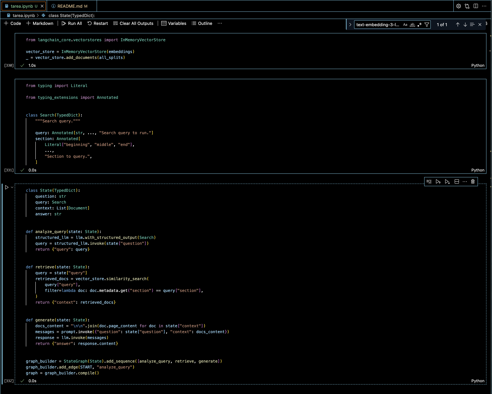
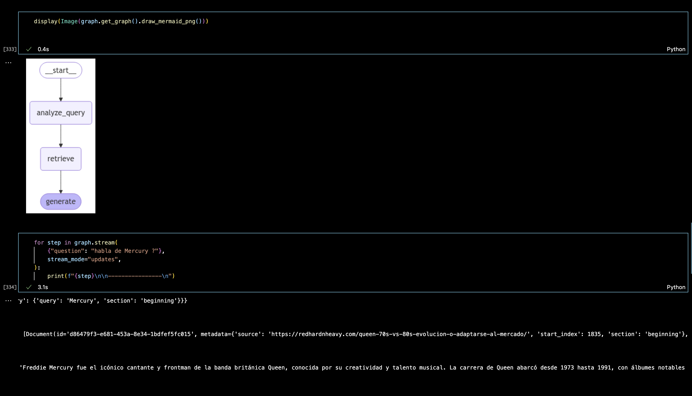
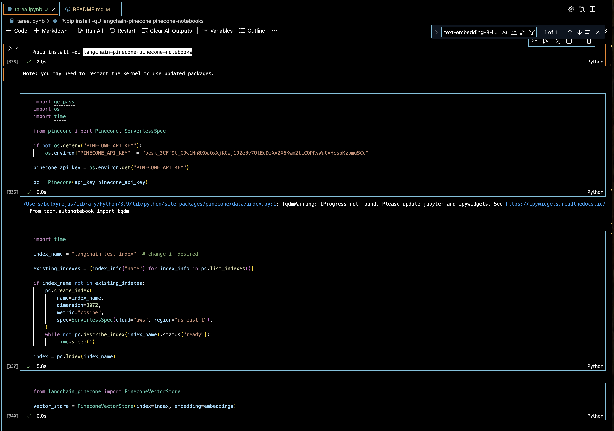
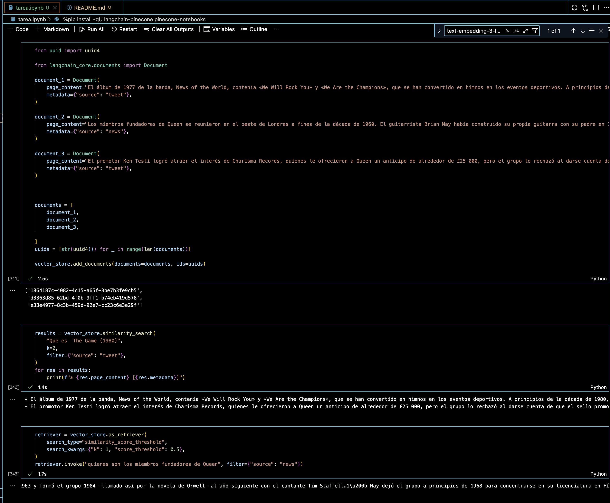

# Creación de un generador mejorado por recuperación (RAG) con LangChain y Pinecone
Este tutorial de LangChain describe cómo construir una aplicación de preguntas y respuestas  usando la técnica de Generación Aumentada por Recuperación (RAG). Se explica la arquitectura típica de una aplicación RAG, dividiéndola en etapas de indexación (carga, división y almacenamiento de datos) y de recuperación y generación (búsqueda de datos relevantes y generación de respuestas con un modelo de lenguaje grande). Se muestran ejemplos usando LangGraph para orquestar las diferentes etapas y LangSmith para monitorear el proceso. Finalmente, se introduce la idea de análisis de consultas para mejorar la búsqueda de información.

# Descripción del ejercicio 

## Funcionalidad principal: 
Este notebook usa técnicas de recuperación de información, como la búsqueda por similitud, para obtener datos sobre temas específicos (en este caso, Queen y su álbum "The Game" de 1980)  fuente orincipal https://redhardnheavy.com/queen-70s-vs-80s-evolucion-o-adaptarse-al-mercado/  Utiliza un sistema de búsqueda para encontrar textos relevantes en un conjunto de documentos y los filtra según el origen (por ejemplo, tweets o noticias).

## En la parte dos del taller se utilizo base de datos: 
Las consultas están orientadas a buscar información de bases de datos de texto (como tweets y artículos de noticias) relacionados con temas específicos.

## Procesamiento de consultas: 
El código permite hacer preguntas específicas sobre ciertos temas (en este caso sobre Queen) y obtener respuestas o fragmentos de textos relacionados, como si fuera una herramienta de búsqueda avanzada.

# Instrucciones de instalación
Para instalar y ejecutar este notebook, necesitarás configurar un entorno adecuado. 

## 1. Instalacion de us entornoi Jupyter

## 2. Se realizaron varias instalaciones como langchain, langchain-community, langchain-chroma, langchain-openai y despues se conecta a Openai con una respectiva OPENAI_API_KEY

## 3. Se instala bs4 que es la librería BeautifulSoup, utilizada para (analizar) y extraer contenido de páginas web en este caso un artilo de la banda de rock Queen.

Este código está diseñado para recuperar y  generar respuestas a preguntas utilizando información de un artículo web. Primero, carga el contenido del artículo, lo divide en fragmentos y lo convierte en vectores de embeddings. Luego, utiliza un modelo para recuperar información relevante y generar una respuesta a partir de ese contexto. Finalmente, devuelve una respuesta a la consulta sobre Freddie Mercury utilizando este sistema.

se observa que le preguntamos  Freddie Mercury quien era? y contesta bastante bien iniciando con Freddie Mercury fue un destacado cantante, pianista y líder de la banda de rock Queen tomado del articulo que se escaneo https://redhardnheavy.com/queen-70s-vs-80s-evolucion-o-adaptarse-al-mercado/

 

 ## 4. Despues se  filtra solo ciertos elementos HTML como el título del post, los encabezados y el contenido del artículo. Luego, calcula y muestra la longitud del contenido extraído en términos de caracteres.

  

## 5. Despues el código realiza una búsqueda de similitud en un conjunto de documentos indexados, utilizando el método as_retriever() para buscar los 6 documentos más relevantes a la consulta "¿En qué año murió Freddie Mercury?". Luego, calcula la cantidad de documentos recuperados con len(retrieved_docs), que debería devolver 6 (si hay al menos 6 documentos relevantes). y nos da el resultado de lo que encontro 

  

  ## 6. Se define una plantilla para la generación de respuestas utilizando el contexto de los documentos recuperados.

 

 ## 7. Este código define un sistema de procesamiento estructurado de preguntas y respuestas que sigue un flujo ordenado de tareas:

Análisis de la pregunta (generación de consulta).
Recuperación de documentos (búsqueda de información relevante).
Generación de la respuesta (creación de una respuesta concisa utilizando el contexto recuperado).
Este tipo de sistema es común en escenarios donde se requiere usar la información recuperada para proporcionar respuestas precisas a preguntas complejas, como en los sistemas de retrieval-augmented generation (RAG).

 

 ## 7. Este código se utiliza para ejecutar  tareas que procesa una consulta de forma interactiva, proporcionando actualizaciones paso a paso del proceso. Esto es útil cuando se requiere ver el avance del procesamiento en tiempo real, como en aplicaciones que interactúan con el usuario y proporcionan respuestas de manera incremental.

Generación de la Consulta: La primera actualización podría mostrar la consulta generada a partir de la pregunta, algo como: "query": "Mercury death date".
Recuperación de Documentos: La siguiente actualización podría mostrar una lista de documentos recuperados relacionados con Mercury.
Generación de Respuesta: Finalmente, el resultado de la generación podría ser una respuesta breve sobre Freddie Mercury, como: "answer": "Freddie Mercury died in 1991. Thanks for asking!".
 

 # Parte 2  LangChain con Pinecone

 ## 1. Se realizan instalaciones de langchain-pinecone, pinecone-notebooksEste, y el fragmento de código está configurando y utilizando la API de Pinecone, que es un servicio de base de datos vectorial que permite realizar búsquedas de similitud de alta eficiencia, comúnmente usado para aplicaciones de búsqueda semántica, recomendación y recuperación aumentada por generación (RAG).

Crear índices para almacenar vectores.
Realizar búsquedas de vectores basadas en similitud.
Actualizar o borrar vectores.

## 2. Este código utiliza la biblioteca Langchain y la API de Pinecone para agregar documentos a una base de datos vectorial. en este caso informacion de la banda de Rock tomada de Wikipedia, noticias, y tweets

Despues se configura un recuperador que solo devuelve los documentos cuyo puntaje de similitud supera el umbral de 0.5.
La consulta "quienes son los miembros fundadores de Queen" se utiliza para buscar documentos relacionados con esa pregunta, y los resultados se filtran para incluir solo documentos provenientes de la fuente "news".

Resumen de la Salida :
En la búsqueda por similitud, el código imprimirá los 2 documentos más similares a la consulta "Que es The Game (1980)" cuyo campo de metadatos "source" sea "tweet". La salida mostrará el contenido y los metadatos de los documentos recuperados.

* El álbum de 1977 de la banda, News of the World, contenía «We Will Rock You» y «We Are the Champions»

* Los miembros fundadores de Queen se reunieron en el oeste de Londres a fines de la década de 1960...
En la recuperación con umbral de similitud, el código recuperará el documento más similar a la consulta "quienes son los miembros fundadores de Queen", pero solo si tiene una puntuación de similitud mayor o igual a 0.5, y el documento debe ser de la fuente "news".

Este enfoque de búsqueda y recuperación permite realizar consultas precisas sobre documentos con base en su contenido y metadatos, lo que es útil en aplicaciones de recuperación de información y sistemas de recomendación.

